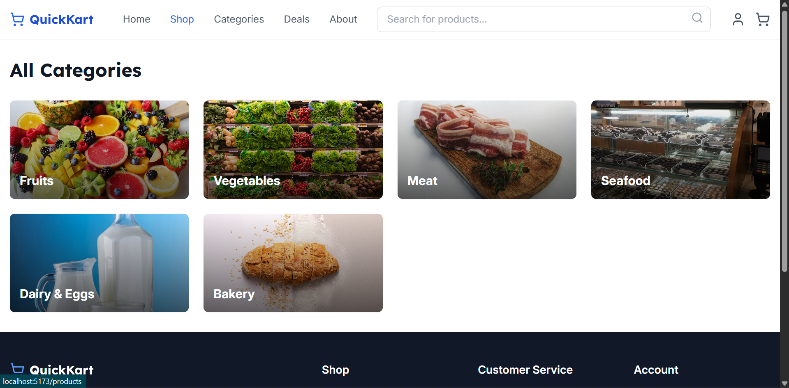
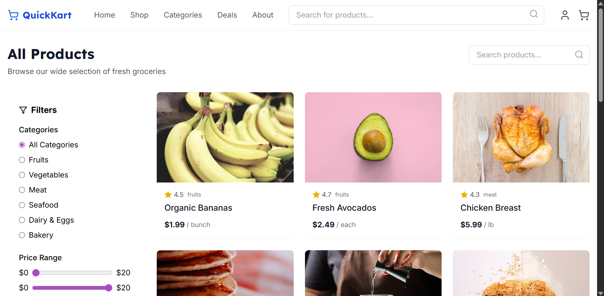

<xaiArtifact artifact_id="42b39617-a0bd-46b4-8cfe-9df3dec85145" artifact_version_id="9d87644f-7a0e-43ce-9ef3-868f2e4bfe17" title="README.md" contentType="text/markdown">
# E-commerce Store 🏬

A modern e-commerce app built with React and TypeScript, featuring a responsive UI, product browsing, and cart management. 🌟

## Screenshots 📸

- **Home Page**:  🏠
- **Category Page**:  📋
- **Shop Page**:  🛍️

## Installation ⚙️

1. Clone the repo: `git clone <repo-url>` 📂
2. Install dependencies `'npm install'` 🔧
3. Start the dev server: `npm start` 🚀

## Tech Stack 💻

- React ⚛️
- TypeScript 📜
- Tailwind CSS 🎨
- React Router 🛤️

## Usage 🎉

Browse products, add to cart, and checkout with a mock payment gateway. 🛒💸
